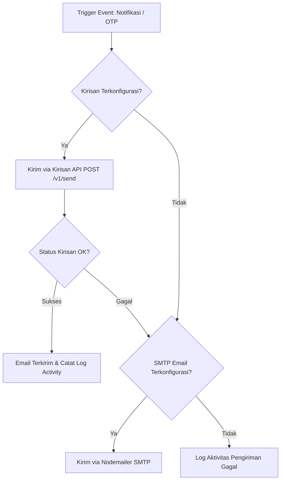

# Dokumentasi Implementasi Kirisan API (Email & OTP Gateway)

Dokumen ini menjelaskan secara lengkap arsitektur, cara kerja, konfigurasi, variabel template, serta alur pengiriman email dan OTP menggunakan layanan **Kirisan API** di dalam proyek DomainWhois.

---

## 📋 1. Ringkasan & Arsitektur Integrasi

Proyek ini menggunakan **Kirisan API** (`https://api.kirisan.com/v1/send`) sebagai gateway utama untuk pengiriman email transaksional dan OTP. 

### Fitur yang Didukung Kirisan:
1. **Domain & Server Expiration Alerts**: Notifikasi otomatis saat domain atau server mendekati tanggal kedaluwarsa.
2. **Login OTP**: Pengiriman kode OTP 6-digit saat pengguna melakukan login.
3. **Register OTP / Email Verification**: Pengiriman kode verifikasi saat pendaftaran akun baru.
4. **Reset Password OTP**: Pengiriman kode verifikasi untuk mengatur ulang kata sandi.
5. **Test Notification**: Fitur pengujian koneksi langsung dari panel pengaturan Admin.

### Alur Kerja (Workflow):


---

## ⚙️ 2. Pengaturan Database (`app_settings`)

Konfigurasi Kirisan disimpan secara dinamis di dalam tabel database `app_settings`. Berikut adalah kunci-kunci (*keys*) yang digunakan:

| Key (`setting_key`) | Deskripsi | Wajib |
| :--- | :--- | :---: |
| `kirisan_token` | Account Token / API Bearer Token dari Kirisan | **Ya** |
| `kirisan_channel_key` | Channel Key / Token khusus untuk Channel Email | **Ya** |
| `kirisan_template_id` | Template ID untuk Notifikasi Kedaluwarsa Domain/Server | **Ya** |
| `kirisan_login_otp_template_id` | Template ID untuk Email OTP Login | **Ya** |
| `kirisan_register_otp_template_id` | Template ID untuk Email OTP Registrasi | **Ya** |
| `kirisan_reset_password_template_id` | Template ID untuk Email OTP Reset Password | **Ya** |

---

## 🎨 3. Konfigurasi Template di Dashboard Kirisan

Kirisan API **hanya mendukung pengiriman email berbasis Template ID**. Anda wajib membuat template di Dashboard Kirisan (`Channel → Email → Templates`) dan mendefinisikan variabel-variabel dinamis di dalamnya.

### A. Template Expiration Alert (`kirisan_template_id`)
Variabel yang dikirimkan oleh sistem ke template alert:
* `{{alerts_text}}` : Daftar alert dalam format teks biasa (plain text list).
* `{{alerts_html}}` : Daftar alert dalam format tabel/HTML list (`<ul><li>...</li></ul>`).
* `{{alerts_count}}` : Jumlah total item domain/server yang memperingatkan kedaluwarsa.
* `{{first_alert_name}}` : Nama domain/server pertama pada daftar alert.
* `{{first_alert_days}}` : Sisa hari sebelum kedaluwarsa untuk item pertama.
* `{{first_alert_expiry}}` : Tanggal kedaluwarsa item pertama (format: `YYYY-MM-DD`).

### B. Template OTP (`login`, `register`, `reset-password`)
Variabel yang dikirimkan oleh sistem ke template OTP:
* `{{otp}}` / `{{code}}` / `{{reset_code}}` : Kode OTP 6-digit angka (contoh: `849201`).
* `{{purpose}}` : Tujuan OTP (`login`, `register`, atau `reset-password`).
* `{{expiry_minutes}}` : Masa berlaku kode OTP dalam menit (default: `10`).

---

## 📡 4. Spesifikasi Request & Payload API Kirisan

Sistem melakukan HTTP `POST` ke endpoint Kirisan API:

* **Endpoint**: `https://api.kirisan.com/v1/send`
* **Headers**:
  ```http
  Authorization: Bearer <kirisan_token>
  Content-Type: application/json
  ```

### Structural Payload Example (OTP Login):
```json
{
  "keys": {
    "email": {
      "token": "KIRISAN_CHANNEL_KEY"
    }
  },
  "target": {
    "email": "user@example.com",
    "variables": {
      "otp": "654321",
      "code": "654321",
      "reset_code": "654321",
      "purpose": "login",
      "expiry_minutes": 10
    }
  },
  "content": {
    "email": {
      "template": 123
    }
  }
}
```

---

## 🔄 5. Mekanisme Fallback (SMTP Nodemailer)

Untuk menjamin ketersediaan pesan (*high availability*):
1. Sistem akan mencoba mengirim email via **Kirisan API** terlebih dahulu.
2. Apabila Kirisan tidak dikonfigurasi (misalnya `kirisan_token` atau `kirisan_template_id` kosong) atau HTTP API Kirisan mengembalikan respons gagal / error, sistem akan otomatis melakukan **fallback** ke SMTP Nodemailer jika konfigurasi SMTP (`EMAIL_HOST`, `EMAIL_USER`, `EMAIL_PASS`) tersedia di `.env`.
3. Seluruh status pengiriman (berhasil maupun gagal) akan dicatat ke dalam log aktivitas admin (`logActivity` / `logNotificationActivity`).

---

## 🖥️ 6. Cara Mengonfigurasi via Admin Panel

1. Buka aplikasi DomainWhois dan masuk dengan akun **Admin**.
2. Navigasi ke menu **Pengaturan (Settings)**.
3. Gulir ke bagian **Integrasi Email (Kirisan)**.
4. Isi field berikut:
   * **Kirisan Account Token**: Ambil dari *Account → Settings* pada dashboard Kirisan.
   * **Kirisan Channel Key (Email)**: Ambil dari *Channel → Email → Token* pada dashboard Kirisan.
   * **Kirisan Expiry Alert Template ID**: ID Template email notifikasi kedaluwarsa.
   * **Kirisan Reset Password Template ID**: ID Template email reset password.
   * **Kirisan Login OTP Template ID**: ID Template email login OTP.
   * **Kirisan Register OTP Template ID**: ID Template email verifikasi registrasi.
5. Klik **Simpan Pengaturan**.
6. Klik tombol **Uji Koneksi Kirisan** untuk menguji pengiriman email secara langsung.

---

## 🧪 7. Endpoint Pengujian API (`/api/settings/test-kirisan`)

Admin dapat menguji integrasi Kirisan melalui endpoint khusus:
* **Method**: `POST`
* **Route**: `/api/settings/test-kirisan`
* **Authentication**: Wajib login sebagai Admin (`requireAuth`, `requireAdmin`).
* **Request Body** (opsional if fallback to DB settings):
  ```json
  {
    "kirisan_token": "...",
    "kirisan_channel_key": "...",
    "kirisan_template_id": "...",
    "recipient_email": "admin@example.com"
  }
  ```
* **Response**:
  ```json
  {
    "success": true,
    "message": "Koneksi berhasil! Email uji coba telah dikirim ke admin@example.com"
  }
  ```

---

## 📁 8. File Terkait dalam Codebase

* [`server/server.js`](file:///Users/zuraidasafitri/Downloads/whois/server/server.js) — Mengatur fungsi `sendOTPEmail` (OTP Kirisan) dan endpoint `/api/settings/test-kirisan`.
* [`server/notifier.js`](file:///Users/zuraidasafitri/Downloads/whois/server/notifier.js) — Mengatur pengiriman email notifikasi kedaluwarsa via Kirisan API.
* [`server/db.js`](file:///Users/zuraidasafitri/Downloads/whois/server/db.js) — Inisialisasi default settings dan migrasi tabel `app_settings` untuk Kirisan.
* [`src/pages/SettingsPage.tsx`](file:///Users/zuraidasafitri/Downloads/whois/src/pages/SettingsPage.tsx) — Tampilan formulir konfigurasi & tombol uji coba Kirisan di UI Frontend.
